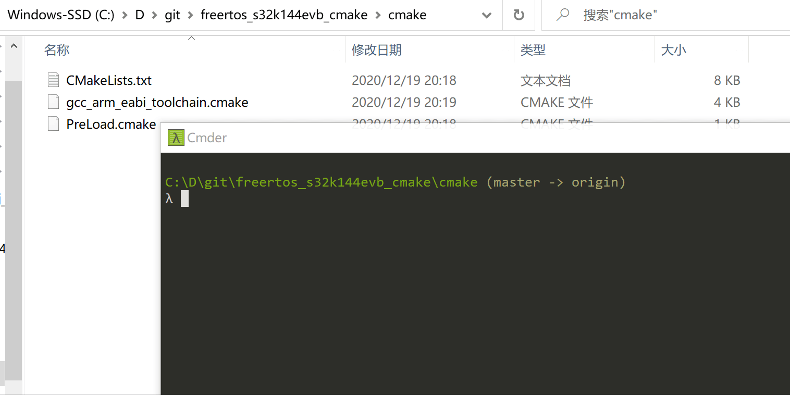
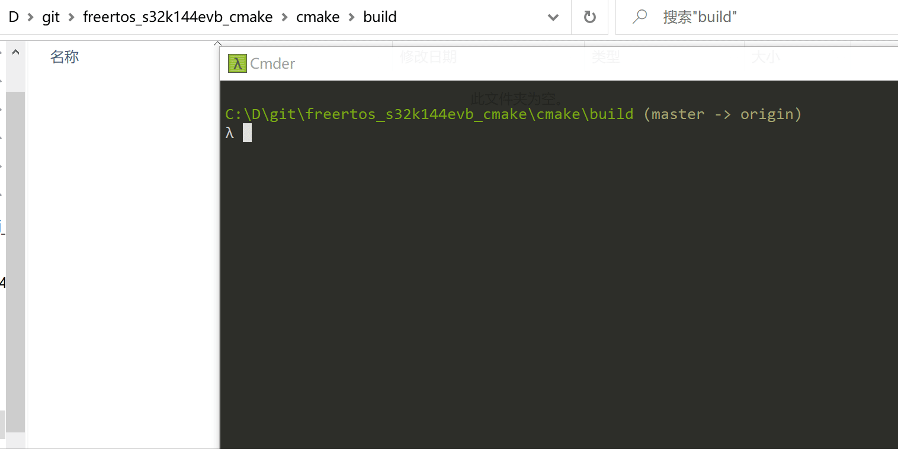
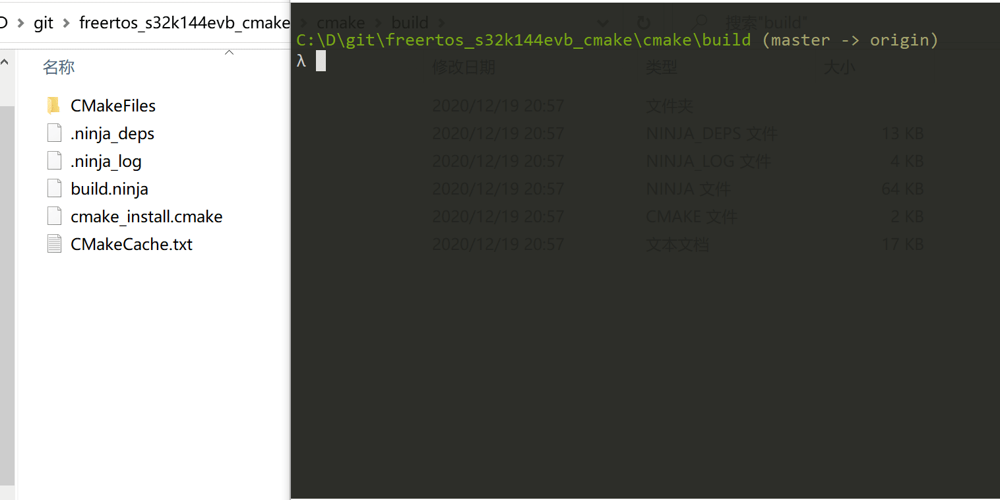

freertos_s32k144evb_cmake
=============================

# 介绍
使用 NXP S32K144 芯片 ，集成 freertos ，进行led点亮，开发版为 s32k144evb ，对应博文[2020年汽车电子软件主流构建方案讲解-cmake](https://zhuanlan.zhihu.com/p/338162422)

# 目的
本示例集成 FreeRTOS ，进行LED 灯间隔点亮 ，目的为指引常规嵌入式软件工程开发，并提供 IDE/Cmake构建系统 进行项目构建的示例及方法

# 使用方法

## 使用S32DS 
到官网上下载 [S32DS](https://www.nxp.com/design/software/development-software/s32-design-studio-ide/s32-design-studio-for-arm:S32DS-ARM), 然后直接导入工程文件夹就好

## 使用Cmake

需要首先安装 [cmake](https://cmake.org/) ，[ninja](https://github.com/ninja-build/ninja/releases) 两个工具 ，ninja 安装方法为解压得到exe文件，然后将exe文件所在路径放入系统路径即可，保证命令行工具可以调用 ninja 命令。

安装完成后可以在命令行中使用 `cmake --verison` ，以及 `ninja --version`来查看是否安装成功。

如下所有操作均使用命令行，演示系统为windows，命令行工具为[Cmder](https://cmder.net/)，也可以使用windows自带命令行工具 cmd

### Step1. 在cmake文件夹下创建build文件夹 ，并进入文件夹

### step2. 在build文件夹下，使用 cmake .. 命令创建Ninja构建系统

### step3. 在build文件夹下，使用 cmake --build . 开始构建

